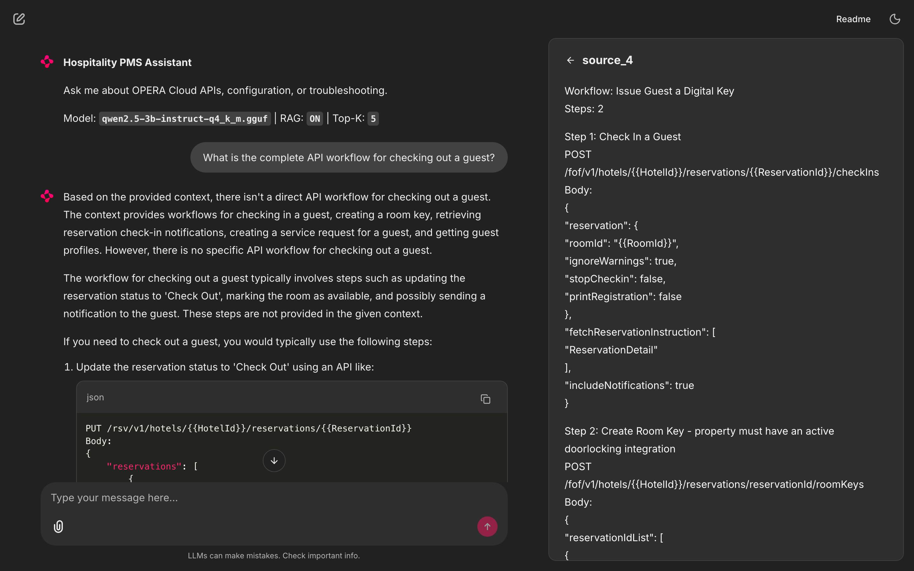

# Hospitality PMS LLM

A domain-adapted language model system for Oracle OPERA Cloud Property Management System (PMS) tasks — API orchestration, configuration advisory, and integration troubleshooting over the [Oracle Hospitality Integration Platform (OHIP)](https://github.com/oracle/hospitality-api-docs) APIs.

Built as an MTech AI & ML dissertation project at BITS Pilani, carried out at ITC Infotech.

## What it does

General-purpose LLMs hallucinate API paths and miss call-sequencing dependencies when asked about PMS integration work. This project measures how much retrieval-augmented generation (RAG) and parameter-efficient fine-tuning close that gap, using small open-source models that a hotel could run on its own hardware.



## Architecture

```
Query → BGE-small-en-v1.5 → ChromaDB (8,781 chunks) → top-5 chunks
      → Qwen2.5 3B/7B (Q4_K_M, llama-cpp-python) → answer
      → Grok judge (1–5 rubric) → score + justification
```

**Corpus** (all public data):

| Source | Chunks |
|---|---|
| OHIP OpenAPI specs (44 files, UPL-licensed) | 5,950 |
| OPERA Cloud User Guide (435 pp, referenced) | 384 |
| Oracle Postman collections (requests + workflows) | 2,447 |

**Benchmark**: 151 tasks — 54 API orchestration, 53 configuration advisory, 44 troubleshooting — split 70/30 dev/test, stratified by module and category. Each task has a reference answer. No public PMS benchmark existed before this.

## Phase 1 results (105-task dev set)

| Config | Mean score (1–5) | Mean latency (T4) |
|---|---|---|
| Qwen2.5-3B base | 1.52 | 8.2 s |
| Qwen2.5-7B base | 1.69 | 14.9 s |
| Qwen2.5-3B + RAG | 2.69 | 7.8 s |
| Qwen2.5-7B + RAG | 2.90 | 15.9 s |

Retrieval matters more than model size: RAG adds +1.17 to the 3B model; doubling parameters adds +0.17. The 3B with RAG beats the 7B without it, at half the latency.

Top failure mode: hallucinated API paths (48% of errors) — retrieval distances are near-identical for successes and failures, so the retriever finds the right chunks and the generator ignores them. Phase 2 (LoRA fine-tuning) targets exactly this.

## Repository layout

```
src/
  parse_api_specs.py    # OpenAPI JSON → per-endpoint chunks
  parse_postman.py      # Postman collections → request/workflow chunks
  chunk_docs.py         # User Guide PDF → heading-aware section chunks
  embed_corpus.py       # embed chunks → ChromaDB
  rag_pipeline.py       # retrieval + generation, all eval configs
  generate_benchmark.py # benchmark task construction
  split_benchmark.py    # stratified dev/test split
  eval_harness.py       # run configs over the benchmark
  score_results.py      # LLM-as-judge scoring
  app.py                # Chainlit chat UI
data/                   # benchmark task sets (JSONL)
notebooks/              # Colab notebooks for GPU runs
```

## Running it

```bash
python -m venv .venv && source .venv/bin/activate
pip install -r requirements.txt

# Build the corpus (needs the raw Oracle data, see below)
python src/parse_api_specs.py && python src/parse_postman.py && python src/chunk_docs.py
python src/embed_corpus.py

# Download a model (e.g. Qwen2.5-3B-Instruct Q4_K_M GGUF) into models/

# Chat UI
RAG_CONFIG=3B-RAG chainlit run src/app.py

# Evaluation
python src/eval_harness.py --config 3B-RAG --split dev
python src/score_results.py
```

Raw data is not committed. API specs come from [oracle/hospitality-api-docs](https://github.com/oracle/hospitality-api-docs) (UPL 1.0); the OPERA Cloud User Guide and Postman collections are available from Oracle's public documentation and developer portal.

## Status

- **Phase 1 (done)**: corpus, benchmark, RAG pipeline, 4-config evaluation, error analysis
- **Phase 2 (in progress)**: QLoRA fine-tuning of the 3B model, held-out test evaluation, hybrid LoRA+RAG, frontier-model ceiling baseline

## Author

Pradyumna Ray — MTech AI & ML, BITS Pilani (2024CT05003)
